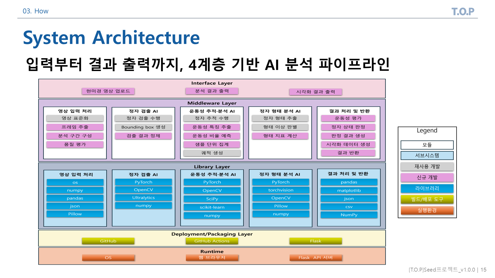
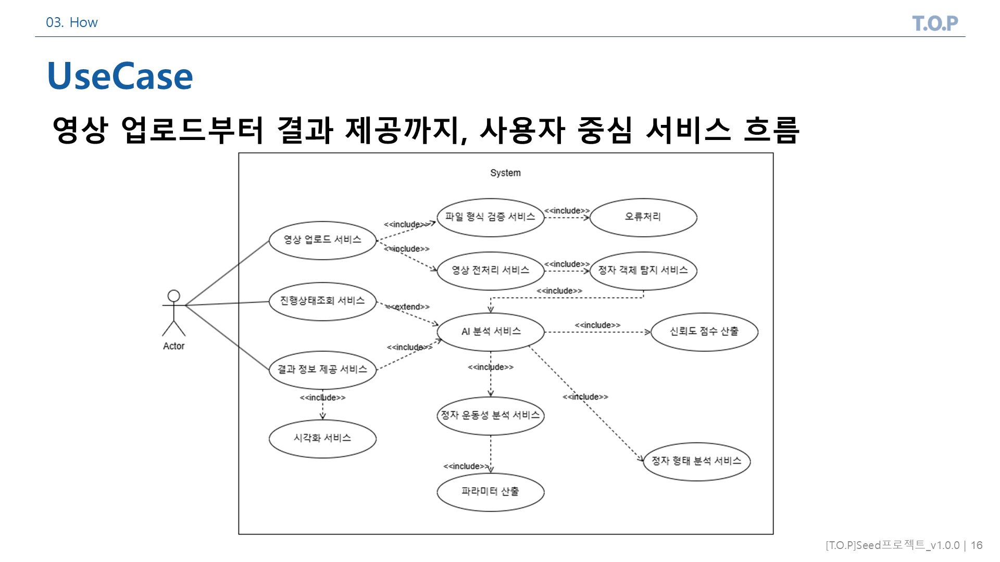
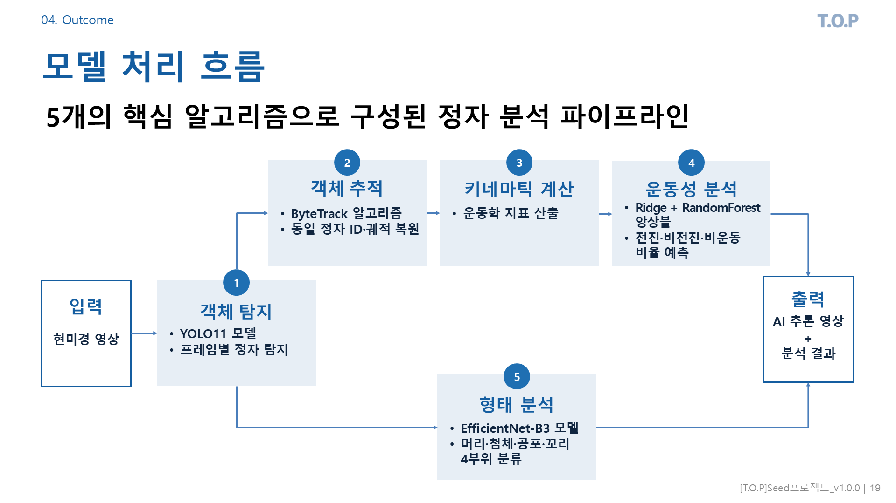
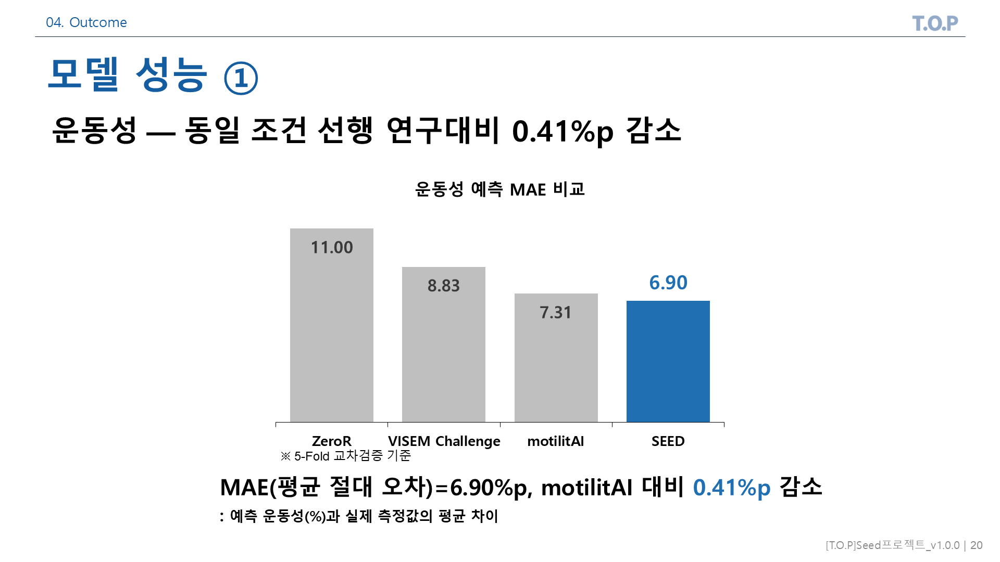
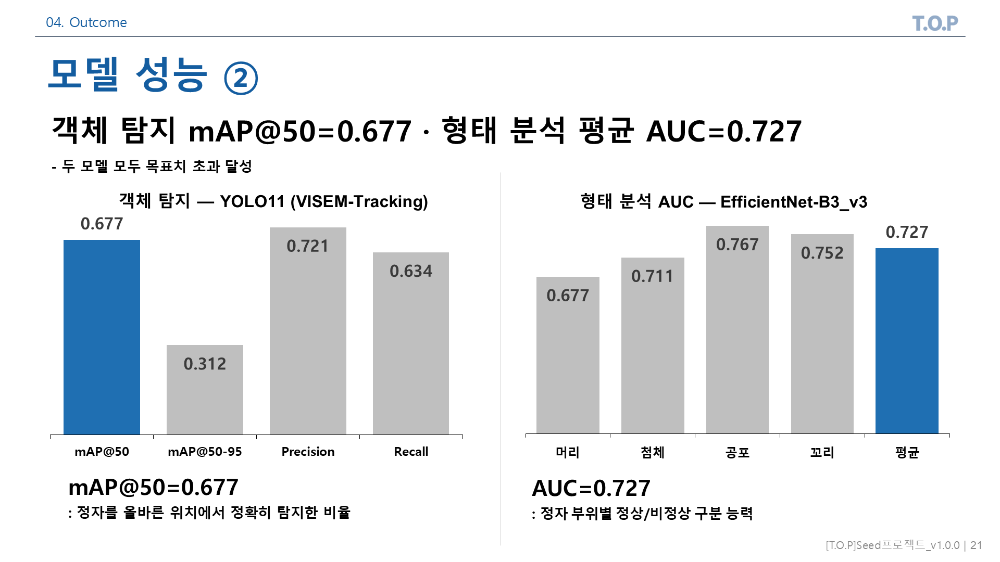
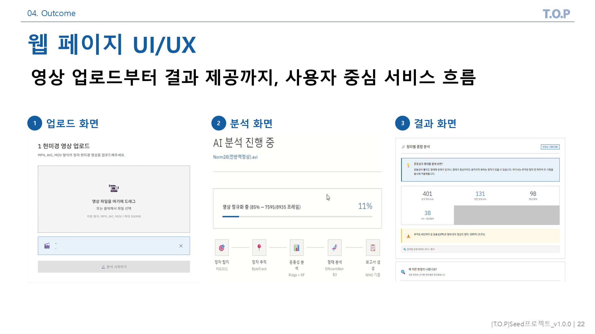
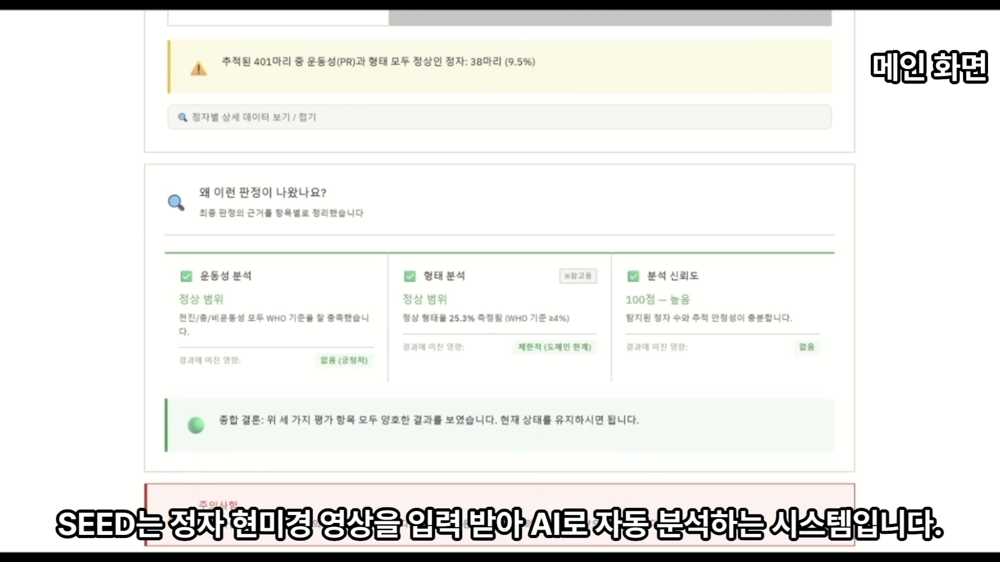

<div align="center">

# 🌱 SEED 프로젝트

## AI 기반 정자 자동 탐지 및 형태·운동성 통합 분석 시스템

<br>

**Team T.O.P** — *Technology Of Prognosis*

`PM 김민지` · `CM 지승현` · `QA 서현준` · `ENG1 김태경` · `ENG2 김혜현`

지도교수 **송기원 교수님**  |  2026-1 융합캡스톤디자인 I 최종발표  |  `Ver 1.0.0`

<br>


</div>

> 📑 본 README는 **최종 발표 자료([`deliverables/[T.O.P]Seed_최종발표_v1.0.0.pptx`](deliverables/))를 그대로 옮긴 구성**입니다.
> 발표 슬라이드의 목차·흐름을 따라 프로젝트 전체를 한눈에 이해할 수 있도록 작성되었습니다.

---

## 📋 목차

| | 장 | 내용 |
|---|---|---|
| **01** | [Introduction](#01-introduction) | 회사 소개 · 조직도 · 프로젝트 소개 · 개발방법론 |
| **02** | [Problem](#02-problem) | 문제 인식 · 문제 정의 · 해결 방안 |
| **03** | [How](#03-how) | Actor 정의 · 개발환경 · System Architecture · Use Case |
| **04** | [Outcome](#04-outcome) | 데이터셋 · 모델 처리 흐름 · 모델 성능 · UI/UX · 시연 · 기대효과 |
| **05** | [Artifacts](#05-artifacts) | MS Project · 산출물 현황 · 향후 계획 · 추적성 · GitHub |
| **06** | [Reference](#06-reference) | 참고문헌 |
| **+** | [Appendix](#appendix) | 키네마틱 지표 · WHO 기준 · 모델 상세 · 데이터셋 · 한계 |
| **+** | [Quick Start](#-quick-start) | 실행 방법 · 프로젝트 구조 |

---

# 01. Introduction

## 🏢 회사 소개

> ### AI를 활용한 질병 예측 실현

**T.O.P** 는 *"Technology Of Prognosis"* 의 약자로, **예측 기술** 이라는 의미를 담고 있다.

## 👥 조직도

> ### 분산형 팀 구성

| 역할 | 이름 | 담당 업무 | 개발 파트 |
|---|---|---|---|
| **PM** | 김민지 | 프로젝트 총괄 · 일정 관리 · 진척도 관리 | 운동성 분석 모델 구현 |
| **CM** | 지승현 | 개발 환경 표준화 · 산출물 형상 관리 · 소스 코드 통합 | 데이터 수집 및 전처리 |
| **QA** | 서현준 | 산출물 품질 관리 · 시스템 위험 요소 관리 · 모델 성능 모니터링 | 객체 탐지 모델 구현 |
| **ENG1** | 김태경 | 시스템 구조 설계·제작 · 통합 관리 · 성능 개선 | 형태 분석 모델 구현 |
| **ENG2** | 김혜현 | 시스템 구조 설계·제작 · 통합 관리 · 성능 개선 | 웹페이지 구현 |

## 🌱 프로젝트 소개

> ### AI 기반의 정자 자동 탐지 및 운동성 분석 시스템

**SEED** — *"Sperm Evaluation and Embryo Development"* 의 약자.

AI가 영상 속 정자를 자동으로 검출하고 추적하여, 정자의 상태를 **정량적으로 평가** 하는 시스템을 구축한다.

## 🔄 개발방법론

> ### 단계별 산출물과 검증 절차를 적용하는 폭포수(Waterfall) 개발 방법론

```
제안  →  분석  →  설계  →  구현  →  시험  →  완료
```

각 단계마다 산출물을 작성하고 검증 절차를 거쳐 다음 단계로 진행한다.

---

# 02. Problem

## 🔍 문제 인식

> ### 남성 관련 요인은 전체 불임의 약 50%, 진단 수도 더 빠르게 증가 중

- 전체 불임 원인 중 약 **50%** 가 남성 요인 또는 복합 요인 — 불임은 여성만의 문제가 아니다.
- 2024년 국내 남성 난임 진단 **10만 명 돌파**, 증가 속도는 여성보다 빠름.
- 국내 난임 진단자 수 변화(2020 → 2024): **남성 +36.9%** · 여성 +28.5%

<br>

> ### 수동 판독 방식은 결과 일관성과 정량 분석에 한계가 있음

검사자가 현미경 영상 속 정자를 하나씩 수동으로 관찰하며 상태를 기록하는 방식.

| # | 한계 | 내용 | 결과 |
|---|---|---|---|
| 1 | **검사자 주관 개입** | 숙련도·컨디션에 따라 결과 편차, 동일 샘플도 다른 결과 | → 일관된 평가 어려움 |
| 2 | **긴 분석 시간** | 수백\~수천 개 정자를 수동 관찰, 30분\~1시간 소요 | → 검사 효율 낮음 |
| 3 | **정량화 한계** | 운동성·궤적 정량화 곤란, 형태 평가는 주관적 기준 의존 | → 객관적 지표 확보 어려움 |

<br>

> ### CASA를 통해 자동화되었으나, 통합 분석과 접근성에 한계 존재

**CASA** (*Computer-Assisted Sperm Analysis*) — 현미경 영상과 이미지 분석 알고리즘으로 정액 분석을 자동화한 시스템.

| # | 한계 | 내용 | 결과 |
|---|---|---|---|
| 1 | **형태 분석의 한계** | 형태 판독은 여전히 전문가의 수동·주관적 판단에 의존 | → 시간 소요 및 일관성 문제 |
| 2 | **형태·운동 분리 분석** | 형태와 운동성을 따로 분석, 동일 정자 기준 결과 미제공 | → 통합적 평가가 어려움 |
| 3 | **낮은 접근성** | 고가 장비(3\~4만 달러) · 전문 인력 필요 | → 일반 의료기관 도입 제약 |

<br>

> ### 시중 자가검사 제품, 정밀 진단 불가

| 제품 유형 | 대표 제품 | 주요 한계점 |
|---|---|---|
| 국내 즉석 키트 | TENGA Men's Loupe | 정자 농도 확인 위주 · 형태·정액량·pH 측정 불가 |
| 해외 즉석 키트 | YO Home Sperm Test (FDA 승인) | 핵심 지표인 정자 **형태 측정 불가** |
| 우편 발송 키트 | Fellow Semen Analysis | 결과 통보 대기 시간 · 형태 등 주요 파라미터 측정 미비 |

## 🎯 문제 정의

> ### 객관적·통합적이고 접근이 용이한 AI 정자 분석 시스템 부재

| # | 문제 | 내용 | 결과 |
|---|---|---|---|
| 1 | **결과 객관성 부족** | 수동 판독 편차, CASA 형태 판독의 전문가 주관 의존 | → 시간 소요 및 일관성 문제 |
| 2 | **형태·운동성 통합 분석 부재** | 형태·운동성 분리 분석, 동일 정자 객체 통합 분석 부재 | → 단편적 분석으로 종합 평가 한계 |
| 3 | **낮은 접근성** | 고가 장비·전문 인력 필요 | → 일반 의료기관·일반인 사용 제약 |

## ✅ 해결 방안

> ### AI 기반의 정자 자동 탐지 및 형태·운동성 분석 시스템

| # | 기여 | 핵심 기술 | 목표 성능 |
|---|---|---|---|
| 1 | **정량화된 운동성 분석** | YOLO11 정자 탐지 + ByteTrack 추적 + VCL·VSL 등 키네마틱* 산출 | mAP@50 ≥ 0.65 · MAE ≤ 7.0 |
| 2 | **형태·운동성 통합 분석** | EfficientNet-B3 형태 분석 + 운동성·형태 모듈 통합 | 부위별 평균 AUC ≥ 0.72 |
| 3 | **분석 접근성 향상** | 일반 현미경 영상만으로 동작 · 고가 장비 없이 웹 기반 결과 산출 | — |

> *키네마틱: 움직임의 특성 — 정자가 얼마나 빠르게, 어떤 경로로, 얼마나 직선적으로, 얼마나 크게 흔들리며 움직이는지를 숫자로 나타낸 값.

---

# 03. How

## 🎭 Actor 정의

> ### 남성 사용자와 의료진을 중심으로 분석·참고 보조 도구 제공

| Actor | 상황 | 목표 |
|---|---|---|
| **남성 사용자** | 임신 계획이 있어 불임 여부를 사전에 확인하고 싶은 환자 | 전문 장비·인력 없이 자가 점검 |
| **의료진** | 정액 분석 보조 참고 도구가 필요한 의료진 | 객관적·정량적 수치로 판독 보조 |

## 🛠 개발환경

> ### 오픈소스 기반의 안정적인 AI 개발 환경 구성

| 구분 | 기술 |
|---|---|
| 개발 언어 | **Python** 3.10 |
| 개발 툴 | **JupyterLab** · Cursor IDE |
| AI 프레임워크 | **PyTorch** · Ultralytics (YOLO11) · scikit-learn |
| 웹 · API 서버 | **Flask** · Gunicorn |
| 외부 배포 | **ngrok** · Render |
| 버전 관리 | **Git · GitHub** |

## 🏗 System Architecture

> ### 입력부터 결과 출력까지, 4계층 기반 AI 분석 파이프라인

<p align="center"></p>

**데이터 흐름 관점** — 모듈 매핑:

```
┌─────────────────────────────────────────────────────────────────┐
│  [입력 계층]    현미경 영상(.mp4/.avi) → 품질 평가 · 영상 정규화      │
│                 quality.py · normalizer.py  →  640×480 / 50fps     │
├─────────────────────────────────────────────────────────────────┤
│  [탐지·추적]    YOLO11 정자 탐지  →  ByteTrack ID·궤적 복원          │
│                 detector.py · tracker.py                          │
├─────────────────────────────────────────────────────────────────┤
│  [분석 계층]    키네마틱 산출 · 운동성 회귀 · 형태 분류              │
│                 casa_features.py · analyzer.py · morphology.py     │
├─────────────────────────────────────────────────────────────────┤
│  [해석·출력]    WHO 기준 판정 · 신뢰도 점수 · 주석 영상 · 웹 리포트   │
│                 interpreter.py · annotator.py · webapp/           │
└─────────────────────────────────────────────────────────────────┘
```

## 📋 Use Case

> ### 영상 업로드부터 결과 제공까지, 사용자 중심 서비스 흐름

<p align="center"></p>

사용자가 웹에서 현미경 영상을 업로드하면, 서버가 비동기로 분석을 수행하고
운동성·형태·키네마틱 지표와 신뢰도 점수가 담긴 결과 화면을 제공한다.

---

# 04. Outcome

## 🗂 데이터셋 설명

> ### 공신력 있는 공개 데이터셋을 출처로 활용 — 용도별 3종

원본 데이터 총 규모: 영상 **105편** (VISEM-Tracking 20 · VISEM 85), 주석 프레임 약 **29,000장**, 형태 크롭 이미지 **1,540장**.

| 용도 | 데이터셋 | 제공처 | 데이터 유형 |
|---|---|---|---|
| 객체 탐지·추적 | **VISEM-Tracking** | SimulaMet · OsloMet (2023) | 현미경 영상(640×480, 50fps) + 바운딩박스·추적 ID |
| 운동성 분석 | **VISEM** (원본) | SimulaMet · OsloMet (2019) | 현미경 영상 + 운동성 측정값(CSV), 참가자 85명 |
| 형태 분석 | **MHSMA** | Javadi & Mirroshandel (2019) | 정자 크롭 이미지(128×128) 1,540장 + 4개 부위 레이블 |

- **VISEM 계열** — *Nature Scientific Data* 게재 · CC BY 4.0. 국제 학술대회(MediaEval) 채택 표준 데이터 → 세계 최고 연구와 동일 조건 비교 가능.
- **MHSMA** — 정자 형태 분석 분야 표준 벤치마크. 비염색·현미경 조건이 실제 분석 영상과 동일.

## ⚙️ 모델 처리 흐름

> ### 5개의 핵심 알고리즘으로 구성된 정자 분석 파이프라인

<p align="center"></p>

| # | 단계 | 모델 / 알고리즘 | 역할 |
|---|---|---|---|
| ① | 객체 탐지 | **YOLO11** | 프레임별 정자 탐지 |
| ② | 객체 추적 | **ByteTrack** | 동일 정자 ID·궤적 복원 |
| ③ | 키네마틱 계산 | CASA 지표 산출 | 운동학 지표(VCL/VSL/ALH 등) |
| ④ | 운동성 분석 | **Ridge + RandomForest 앙상블** | 전진·비전진·비운동 비율 예측 |
| ⑤ | 형태 분석 | **EfficientNet-B3** | 머리·첨체·공포·꼬리 4부위 분류 |

## 📊 모델 성능

> ### 운동성·탐지·형태 — 목표치를 전 항목 초과 달성 ✅

| 항목 | 지표 | 결과 | 목표 | 의미 |
|---|---|---|---|---|
| **운동성** | MAE | **6.90 %p** | ≤ 7.0 | 예측 운동성(%)과 실제 측정값의 평균 차이 |
| **객체 탐지** | mAP@50 | **0.677** | ≥ 0.65 | 정자를 올바른 위치에서 정확히 탐지한 비율 |
| **형태** | 평균 AUC | **0.727** | ≥ 0.72 | 정자 부위별 정상/비정상 구분 능력 |

- 운동성 MAE 6.90%p — 동일 조건 선행 연구 **motilitAI(7.31%p) 대비 0.41%p 감소** (5-Fold 교차검증 기준).
- 객체 탐지·형태 분석 두 모델 모두 목표치 초과 달성.

<p align="center"></p>
<p align="center"></p>

> 📈 모델 버전별 비교·교차검증·도메인 적응 실험 등 상세 평가는 [`docs/performance.md`](docs/performance.md) 참고.

## 🖥 응용 프로그램 UI/UX

> ### 영상 업로드부터 결과 제공까지, 사용자 중심 서비스 흐름

<p align="center"></p>

**① 업로드 화면** → **② 분석 화면** (비동기 진행) → **③ 결과 화면** (지표·주석 영상)

Flask 기반 웹 애플리케이션으로 구현 (`webapp/` · `app.py`).

## 🎬 시연 영상

영상 업로드부터 결과 제공까지의 전체 분석 과정을 웹 데모에서 시연한다.

<p align="center">
  <a href="docs/images/demo.mp4">
    
  </a>
</p>

> ▶ **이미지를 클릭하면 시연 영상(`docs/images/demo.mp4`)이 재생됩니다.** (데모 실행 방법은 아래 [Quick Start](#-quick-start) 참고)

## 🌟 기대효과

> ### 정확하게, 통합적으로 — 누구나 분석을 받을 수 있는 환경 실현

| # | 효과 | 내용 |
|---|---|---|
| 1 | **분석 객관성 확보** | 검사자 숙련도·컨디션과 무관한 일관된 결과 · 정량적 수치 기반 객관적 판독 보조 |
| 2 | **통합 분석 실현** | 동일 정자 기준 형태·운동성 동시 평가 → 기존 시스템이 불가능했던 종합적 평가 가능 |
| 3 | **분석 접근성 향상** | 고가 장비 없이 일반 현미경 영상만으로 누구나 분석 가능 → 자가 점검 환경까지 확대 |

---

# 05. Artifacts

## 📅 MS Project

> ### 프로젝트 진행률 100%

폭포수 단계별 일정을 MS Project로 관리하였으며, 최종 진행률 **100%** 로 완료.
원본 파일: [`deliverables/[PM]T.O.P_Ms_Project_v1.0.0.mpp`](deliverables/)

## 📦 산출물 진행 현황

> ### 총 21개 산출물

| 단계 | 산출물 | 작성자 |
|---|---|---|
| **제안** | 팀프로젝트편성서 · 로고선정서 · 프로젝트제안서 | PM 김민지 |
| | 산출물관리기획서 | CM 지승현 |
| **분석** | 형상관리계획서 | CM 지승현 |
| | 위험관리계획서 | ENG1·ENG2 |
| | 품질관리계획서 · 요구사항심사서 | QA 서현준 |
| | 프로젝트초기개발기획서 | PM 김민지 |
| | 요구사항분석서 | ENG1·ENG2 |
| **설계** | 기본설계서 · 상세설계서 | ENG1·ENG2 |
| **구현** | 소스코드문서관리서 | CM 지승현 |
| **시험** | 단위시험 계획서·결과서 · 통합시험 계획서·결과서 | QA 서현준 |
| **완료** | 개발완료보고서 | PM 김민지 |
| | 사용자메뉴얼 | ENG1·ENG2 |
| **기타** | 산출물최종양식 | CM 지승현 |
| | MS Project | PM 김민지 |

> 📄 최종 통합 산출물은 [`deliverables/[CM]T.O.P_통합산출물_v1.0.0.hwp`](deliverables/) (PDF 동봉)에 보존되어 있습니다.

## 🚀 향후 개발 계획

> ### 처리 속도 향상 · 저농도 샘플 대응 · WHO 6판 파라미터 확장

| # | 방향 | 내용 |
|---|---|---|
| 1 | **처리 속도 향상** | 영상 전처리 병렬화 · 실시간 처리 구현 → 분석 대기 시간 단축 |
| 2 | **저농도 샘플 대응** | 정자 수 < 10개 시 정확도 저하 보완 · 신뢰도 감점 기준 세분화 · 재촬영 가이드 고도화 |
| 3 | **파라미터 확장** | 현재 미측정 항목(농도·총정자수·생존율) 추가 → WHO 6판 대비 분석 완성도 향상 |

## 🔗 Teams 추적성

프로젝트 전 과정의 일정·산출물·이슈를 **MS Teams** 기반으로 공유·추적하여 형상 관리와 협업 추적성을 확보하였다.

## 💻 GitHub

> 소스 코드 및 시스템 형상 관리: **https://github.com/MoriochoRadio/seed-project**

---

# 06. Reference

<details>
<summary><b>참고문헌 전체 보기 (22편)</b></summary>

1. Leslie, S. W., et al. (2024). *Male infertility.* StatPearls.
2. 국민건강보험공단. (2024). *최근 5년간 난임 진단자 현황.* 국정감사 자료.
3. Liang, Y., et al. (2025). *Global, regional, and national prevalence and trends of infertility (1990–2021).* Human Reproduction, 40(3), 529–544.
4. Bieniek, J. M., et al. (2021). *A Novel Approach to Improving the Reliability of Manual Semen Analysis.* PMC.
5. Siddharth, K., et al. (2023). *Interobserver Variability in Semen Analysis.* Cureus, 15(10), e46388.
6. Barcena, P., et al. (2025). *AI approaches to male infertility in IVF: a mapping review.* PMC.
7. Chawre, S., et al. (2024). *A Review of Semen Analysis: Updates From the WHO Sixth Edition Manual.* Cureus, 16(6), e63485.
8. Mortimer, D., & Mortimer, S. T. (2015). *The future of computer-aided sperm analysis.* Asian Journal of Andrology, 17(4), 545–553.
9. Finelli, R., et al. (2021). *The validity and reliability of computer-aided semen analyzers: a systematic review.* Translational Andrology and Urology.
10. Gonzalez, D., et al. (2021). *Clinical Update on Home Testing for Male Fertility.* World Journal of Men's Health, 39(4), 615–625.
11. Kobori, Y., et al. (2016). *Novel device for male infertility screening with single-ball lens microscope and smartphone.* Fertility and Sterility, 106(3), 574–578.
12. U.S. FDA. (2016). *K161493: YO Home Sperm Test (510(k)).*
13. Samplaski, M. K., et al. (2021). *Development and validation of a novel mail-in semen analysis system.* Fertility and Sterility, 115(4), 922–929.
14. Thambawita, V., et al. (2023). *VISEM-Tracking, a human spermatozoa tracking dataset.* Data in Brief, 47, 108944.
15. Hicks, S. A., et al. (2019). *Machine learning-based analysis of sperm videos and participant data for male fertility prediction.* Scientific Reports, 9, 16770.
16. Javadi, S., & Mirroshandel, S. A. (2019). *A novel deep learning method for automatic assessment of human sperm morphology.* Computers in Biology and Medicine, 109, 182–194.
17. World Health Organization. (2021). *WHO laboratory manual for the examination and processing of human semen* (6th ed.).
18. Zhang, Y., et al. (2022). *ByteTrack: Multi-Object Tracking by Associating Every Detection Box.* ECCV 2022.
19. Tan, M., & Le, Q. V. (2019). *EfficientNet: Rethinking Model Scaling for CNNs.* ICML 2019, PMLR 97, 6105–6114.
20. Miahi, E., et al. (2019). *Genetic Neural Architecture Search for automatic assessment of human sperm images.* arXiv:1909.09432.
21. Finelli, R., et al. (2021). *The validity and reliability of computer-aided semen analyzers.* Translational Andrology and Urology, 10(7), 3069–3079.
22. Gonzalez, D., et al. (2021). *Clinical Update on Home Testing for Male Fertility.* World Journal of Men's Health, 39(4), 615–625.

</details>

---

# Appendix

<details>
<summary><b>📐 키네마틱 지표 ① — 속도</b> (정자가 얼마나 빠르고 곧게 움직이나)</summary>

<br>

| 지표 | 이름 | 정의 | 산출 |
|---|---|---|---|
| **VCL** | 곡선 속도 | 실제로 지나간 구불구불한 경로의 속도 | 실제 경로 길이 ÷ 시간 |
| **VSL** | 직선 속도 | 출발점 → 도착점 직선거리 기준 속도 | 직선 변위 ÷ 시간 |
| **VAP** | 평균경로 속도 | 흔들림을 완만하게 편 평균 경로의 속도 | 평활 경로 ÷ 시간 |

> 산출 시기: 정자 추적(ByteTrack) 직후 · 단위 µm/s · 50fps 기준

</details>

<details>
<summary><b>📐 키네마틱 지표 ② — 직진성·흔들림</b> (어떤 패턴으로 움직이나)</summary>

<br>

| 지표 | 이름 | 의미 | 산출 |
|---|---|---|---|
| **LIN** | 직선성 | 경로가 얼마나 곧은가 | VSL ÷ VCL |
| **STR** | 직진성 | 평균경로 대비 직선 비율 | VSL ÷ VAP |
| **WOB** | 진동도 | 실제경로 대비 평균경로 | VAP ÷ VCL |
| **ALH** | 횡변위 진폭 | 좌우로 흔들리는 폭(µm) | 평균경로 대비 좌우 이탈 |
| **BCF** | 비트교차빈도 | 꼬리가 1초에 좌우 교차(Hz) | 측면신호 영점교차 ÷ 시간 |
| **PAW** | 평균 횡폭 | 경로의 평균 좌우 폭(µm) | 좌우 이탈량의 평균 |

</details>

<details>
<summary><b>🏃 운동성 등급 & WHO 기준</b></summary>

<br>

| 등급 | 이름 | 설명 |
|---|---|---|
| **PR** | 전진 운동성 | 앞으로 곧게 잘 나아가는 정자 — 수정에 가장 중요 |
| **NP** | 비전진 운동성 | 움직이지만 제자리·원형 등 비효율적으로 이동 |
| **IM** | 비운동성 | 거의 움직이지 않는 정자 |

> **WHO 정상 기준** — 총 운동성(PR+NP) ≥ 40% · 전진 운동성(PR) ≥ 32%

</details>

<details>
<summary><b>🤖 AI 모델 4종 & 학습 방식</b></summary>

<br>

| # | 역할 | 모델 | 설명 | 학습 방식 |
|---|---|---|---|---|
| 1 | 객체 탐지 | **YOLO11** | 작은 정자를 빠르게 찾아 박스 표시 | VISEM-Tracking 영상을 프레임 이미지로 분해 → 정자 박스 지도학습 |
| 2 | 객체 추적 | **ByteTrack** | 프레임 간 같은 정자에 같은 번호 → 궤적 복원 | 별도 학습 없음 (탐지 박스 연결 규칙 기반) |
| 3 | 운동성 분석 | **Ridge + RF 앙상블** | 궤적 특징으로 운동성 % 예측, 두 모델 평균으로 안정화 | 추적 궤적의 키네마틱 특징 → VISEM 임상 운동성 수치(CSV) 회귀 학습 |
| 4 | 형태 분석 | **EfficientNet-B3** | 정자 이미지를 보고 4부위 정상 여부 판별 | MHSMA 크롭 1,540장 4부위 분류 + VisemStyleAugment 증강 |

</details>

<details>
<summary><b>📏 성능 지표의 의미</b> (mAP · MAE · AUC)</summary>

<br>

| 지표 | 의미 | 방향 | 본 시스템 |
|---|---|---|---|
| **mAP@50** | 정자를 얼마나 정확히 찾았나 (탐지 정확도) | 높을수록 좋음 ↑ | 탐지 **0.677** |
| **MAE** | 예측 운동성%와 실제값의 평균 차이 | 낮을수록 좋음 ↓ | 운동성 **6.9 %p** |
| **AUC** | 정상/비정상 구분 능력 (0.5=찍기, 1.0=완벽) | 높을수록 좋음 ↑ | 형태 **0.727** |

</details>

<details>
<summary><b>🔬 형태 분석 — 정자의 4부위</b></summary>

<br>

| 부위 | 영문 | 설명 |
|---|---|---|
| **머리** | head | 모양·크기 정상 여부 |
| **첨체** | acrosome | 머리 앞 효소 주머니 — 난자 침투에 필요 |
| **공포** | vacuole | 머리 내부 빈 공간 — 있으면 형태 결함 |
| **꼬리** | tail | 운동을 담당하는 부위 |

> **정상형태율** — 4부위가 모두 정상인 정자 비율 · WHO ≥ 4% 정상 · 도메인 차이로 참고용

</details>

<details>
<summary><b>📊 신뢰도 점수 · 영상 정규화 · 5초 분석</b></summary>

<br>

**신뢰도 점수 (0\~100점)** — 분석 결과를 얼마나 믿을 수 있나
- 목적: 분석 결과의 신뢰도를 0\~100점으로 정량화
- 감점 요인: 정자 수 적음(N<10) · 탐지 불안정 · 추적 짧음
- 활용: 60점 미만이면 **'재촬영 권고'** 출력
- 예시: 정자 2개만 탐지된 영상 → 신뢰도 50점 → 재촬영 권고

**영상 정규화** — 다양한 해상도·프레임률 영상을 학습 도메인(640×480·50fps)에 맞게 자동 변환 → 모델이 일관되게 동작

**5초(250프레임) 분석** — 운동성·CASA 통계는 짧은 구간이면 안정적으로 수렴. 임상 CASA도 짧은 필드를 분석 → 속도·일관성 확보

</details>

<details>
<summary><b>⚠️ 시스템의 한계</b></summary>

<br>

| 항목 | 한계 |
|---|---|
| **형태 분석** | 학습↔적용 도메인 차이로 수치는 참고용 (운동성보다 신뢰도 낮음) |
| **저품질·저농도** | 정자 수가 적거나 흐린 영상은 오차 가능 → 신뢰도 점수로 보완 |
| **용도** | 본 시스템은 **보조·참고 도구**이며 의학적 진단을 대체하지 않음 |

</details>

---

# 🚀 Quick Start

```bash
# 1. 레포 클론
git clone https://github.com/MoriochoRadio/seed-project.git
cd seed-project

# 2. 가상환경 생성 및 의존성 설치
conda create -n seed python=3.10
conda activate seed
pip install -r requirements.txt
# PyTorch는 환경에 맞게 별도 설치 (requirements.txt 상단 주석 참고)

# 3. 모델 가중치 준비
#   - 운동성/형태 모델은 models/ 에 포함
#   - YOLO11 가중치(best.pt)는 Google Drive 자동 다운로드
#     (GDRIVE_* 환경변수 설정 후) python setup_models.py

# 4. 웹 데모 실행
python app.py          # http://localhost:5000
```

> 배포는 [`render.yaml`](render.yaml) 기반으로 Render.com에 구성되어 있다.

## 📂 프로젝트 구조

```
seed-project/
├── app.py            ← Flask 진입점
├── src/              ← 핵심 분석 모듈
│   ├── detector.py       (YOLO11 정자 탐지)
│   ├── tracker.py        (ByteTrack 추적 + 운동성 특징)
│   ├── casa_features.py  (CASA 키네마틱 지표)
│   ├── analyzer.py       (운동성 앙상블 회귀)
│   ├── morphology.py     (EfficientNet-B3 형태 분석)
│   ├── interpreter.py    (WHO 기준 판정 · 신뢰도)
│   ├── normalizer.py     (영상 정규화) · quality.py (품질 평가)
│   ├── annotator.py      (주석 영상 생성) · pipeline.py (통합 파이프라인)
│   └── ...
├── webapp/           ← Flask 웹 애플리케이션 (routes · templates · static)
├── models/           ← 학습된 모델 가중치 (운동성 앙상블, 형태 v3)
├── notebooks/        ← 실험·학습 노트북 (01~16)
├── docs/             ← 프로젝트 문서 (architecture · performance · guides)
├── deliverables/     ← 최종 발표 자료 및 공식 산출물 (v1.0.0)
└── data/             ← 데이터셋 (gitignore 처리)
```

## 📚 더 보기

- **시스템 설계** — [`docs/architecture.md`](docs/architecture.md)
- **성능 평가 상세** — [`docs/performance.md`](docs/performance.md)
- **사용자 / 운영 가이드** — [`docs/USER_GUIDE.md`](docs/USER_GUIDE.md) · [`docs/ADMIN_GUIDE.md`](docs/ADMIN_GUIDE.md)
- **최종 발표 자료 · 산출물** — [`deliverables/`](deliverables/)

---

## 📄 License

본 프로젝트는 **학술 목적의 캡스톤 프로젝트**이며, **임상 진단 도구가 아님**을 명시한다.
배포 라이선스는 [`LICENSE`](LICENSE)(MIT) 참고.

<div align="center">

**Team T.O.P** · *Technology Of Prognosis* · 2026

</div>
