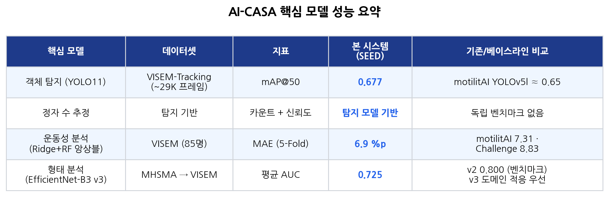
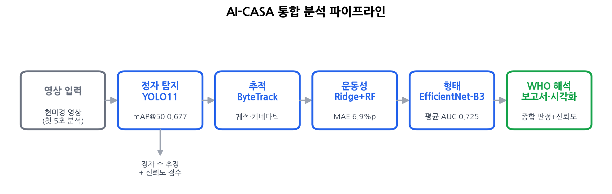
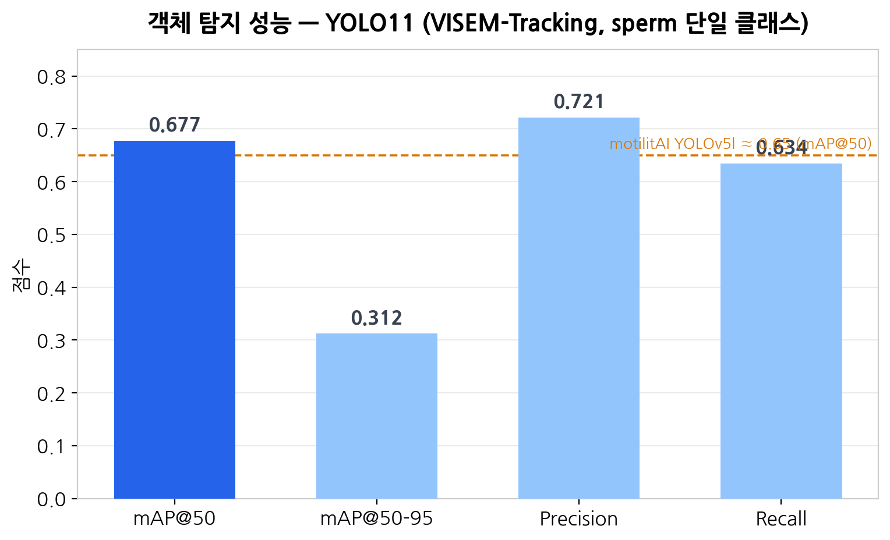
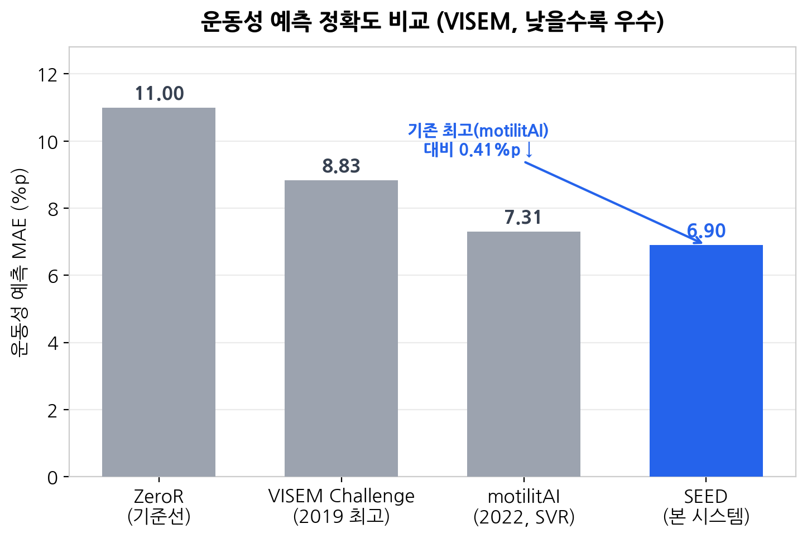
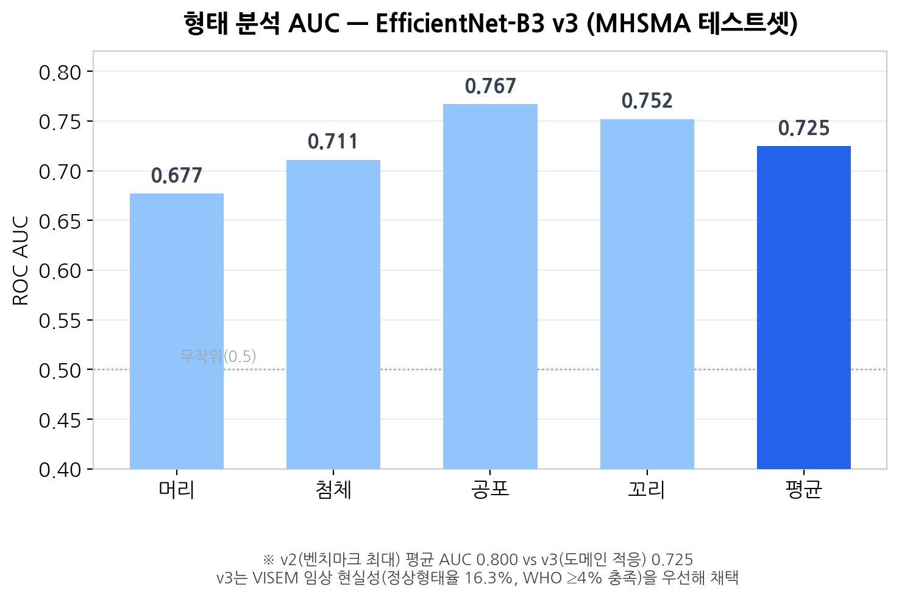
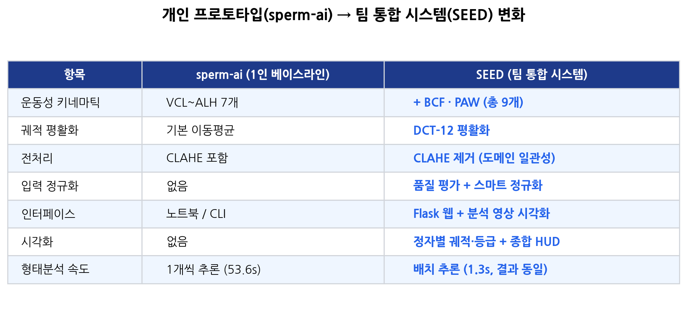
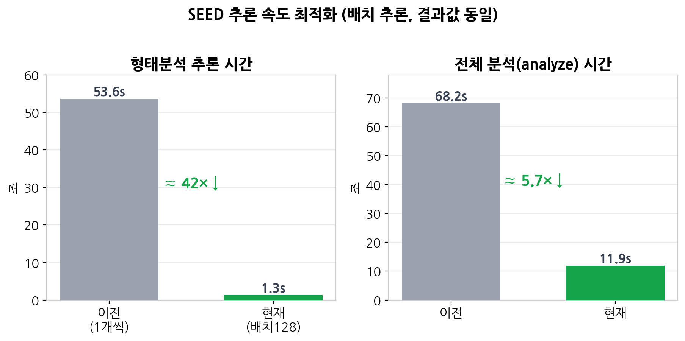

# AI-CASA (SEED) 시스템 성능 정리

> 정자 현미경 영상 기반 AI 종합 분석 시스템 — 발표·PPT용 성능 요약
> 작성 기준: 2026-06-07 / 팀 통합 시스템(SEED), 개인 프로토타입(sperm-ai) 기반

이 문서는 시스템의 핵심 모델 4종 성능을 정리하고, 동일 데이터셋을 사용한 기존 연구 논문 및 개인 베이스라인(sperm-ai)과 비교한다. 각 도표(`figures/`)는 슬라이드에 바로 삽입할 수 있도록 제작했다.

---

## 1. 핵심 모델 성능 요약

시스템은 네 개의 핵심 모델이 순차적으로 동작하는 파이프라인이다: **객체 탐지 → 정자 수 추정 → 운동성 분석 → 형태 분석**, 이후 WHO 기준 해석으로 종합 보고서를 출력한다.

| 핵심 모델 | 데이터셋 | 지표 | 본 시스템(SEED) | 비교 |
|---|---|---|---|---|
| 객체 탐지 (YOLO11) | VISEM-Tracking (~29K 프레임) | mAP@50 | **0.677** | motilitAI YOLOv5l ≈ 0.65 |
| 정자 수 추정 | 탐지 기반 | 카운트 + 신뢰도(0–100) | 탐지 모델 기반 | 독립 벤치마크 없음 |
| 운동성 분석 (Ridge+RF 앙상블) | VISEM (85명) | MAE (5-Fold) | **6.9 %p** | motilitAI 7.31 · Challenge 8.83 |
| 형태 분석 (EfficientNet-B3 v3) | MHSMA → VISEM | 평균 AUC | **0.725** | v2 0.800(벤치마크) / v3 도메인 적응 |

---

## 2. 객체 탐지 — YOLO11

VISEM-Tracking(20명, 약 29,000 프레임)으로 학습했고, 운동성 분석 목적에 맞춰 `sperm` 단일 클래스로 단순화했다. mAP@50 **0.677**, Precision 0.721, Recall 0.634를 기록했다.

motilitAI가 사용한 YOLOv5l의 mAP@50(약 0.65)보다 높다. 다만 VISEM-Tracking의 공식 baseline·최신 YOLOv8 계열 연구는 클래스 구성(정상/클러스터/핀헤드 3-클래스)이나 평가 프로토콜이 달라 직접 순위 비교에는 주의가 필요하며, 본 수치는 "임상적으로 충분한 경쟁력 있는 수준"으로 해석하는 것이 타당하다.

---

## 3. 정자 수 추정 + 신뢰도

정자 수는 별도 모델이 아니라 탐지 결과 기반으로 추정하며, 분석 결과의 **신뢰도 점수(0–100)** 산정에 사용된다(정자 수가 적거나 탐지가 불안정하면 감점 → 60점 미만 시 재촬영 권고). 독립 벤치마크 지표는 없고 탐지 모델 성능에 종속된다.

---

## 4. 운동성 분석 — Ridge + RandomForest 앙상블 (헤드라인)

가장 강력한 비교 지점이다. **동일 데이터셋(VISEM) · 동일 지표(MAE)** 로 기존 연구와 직접 비교된다.

| 방법 | MAE (%p) | 비고 |
|---|---|---|
| ZeroR (기준선) | 11.0 | 항상 평균값 예측 |
| VISEM/Medico Challenge (2019 최고) | 8.83 | 대회 최고 제출 |
| motilitAI (2022, 선형 SVR) | 7.31 | 기존 논문 최고 |
| **SEED (본 시스템)** | **6.9** | 5-Fold CV, 기존 최고 대비 0.41%p ↓ |

핵심 돌파구는 학습 데이터를 VISEM-Tracking 20명에서 VISEM 원본 85명으로 확장하고, Ridge와 RandomForest를 앙상블한 것이다. 동일 조건에서 기존 최고 논문(motilitAI)을 0.41%p 앞선다.

---

## 5. 형태 분석 — EfficientNet-B3 v3 (정직한 맥락)

MHSMA(1,540장, 4부위) 학습 모델을 VISEM 영상 크롭에 적용한다. v3 테스트셋 평균 AUC는 **0.725**(머리 0.677 / 첨체 0.711 / 공포 0.767 / 꼬리 0.752)이다.

**중요(정직한 평가):** 이 수치는 "벤치마크 최고치"가 아니다. v2는 MHSMA에서 평균 AUC 0.800으로 더 높지만, VISEM 실제 적용 시 정상형태율이 0.5%로 비현실적이었다. v3는 VISEM 도메인 증강을 적용해 벤치마크 AUC를 일부 양보(0.800→0.725)하는 대신 **임상 현실성**(정상형태율 16.3%, VISEM 4명 전원 WHO ≥4% 충족)을 확보했고, 파이프라인에는 v3를 채택했다. 또한 MHSMA(학습)↔VISEM(적용) 도메인 차이가 존재하므로 **형태 수치는 참고용**이며, 운동성 분석만큼의 절대 신뢰도는 아니다. MHSMA 벤치마크에서 정확도 89–92%를 보고하는 최신 연구들과는 지표(정확도 vs AUC)와 목표(벤치마크 최대화 vs 도메인 적응)가 달라 직접 비교 대상이 아니다.

---

## 6. 개인(sperm-ai) → 팀(SEED) 변화

개인 프로토타입(sperm-ai)을 베이스라인으로, 팀 통합 과정에서 모델 자체(학습 가중치)는 유지하되 **계산 파이프라인·인터페이스·운영 효율**이 개선됐다.

특히 추론 속도를 크게 최적화했다. 형태 분석을 크롭 1개씩 추론하던 방식에서 배치(128) 추론으로 바꿔, **결과값은 동일하게 유지**하면서 시간을 대폭 줄였다.

- 형태분석 추론: 53.6초 → **1.3초** (약 42배 단축)
- 전체 분석(analyze): 68.2초 → **11.9초** (약 5.7배 단축)

---

## 7. 발표 시 강조 포인트

운동성 분석은 동일 데이터셋·지표에서 기존 최고 논문을 앞선 **검증 가능한 성과**이므로 핵심 메시지로 내세우기 적합하다. 형태 분석은 "벤치마크 점수"가 아니라 **도메인 적응을 통한 임상 현실성 확보**라는 관점으로 설명해야 정확하고 방어 가능하다. 탐지는 경쟁력 있는 수준으로 제시하되 클래스 구성 차이를 인지하고 과도한 순위 주장은 피한다.

---

## 8. 비교 수치 출처

- motilitAI (운동성 MAE 8.83→7.31, VISEM): *iScience* 2022 — https://pmc.ncbi.nlm.nih.gov/articles/PMC9287611/
- VISEM-Tracking 데이터셋 및 탐지 baseline: *Nature Scientific Data* 2023 — https://www.nature.com/articles/s41597-023-02173-4
- 최신 탐지/추적 (Sperm YOLOv8E-TrackEVD, 2024): https://www.ncbi.nlm.nih.gov/pmc/articles/PMC11175353/
- MHSMA 형태 분류 최신 연구 (CBAM-ResNet50, 2025): https://journals.plos.org/plosone/article?id=10.1371/journal.pone.0330914
- 형태 멀티태스크 전이학습 (Abbasi et al., 2021): https://www.sciencedirect.com/science/article/abs/pii/S0010482520304522

> 본 시스템(SEED)의 자체 지표(mAP 0.677, MAE 6.9%p, AUC 0.725 등)는 프로젝트 내부 검증(5-Fold CV, 홀드아웃 테스트셋) 결과이다.
